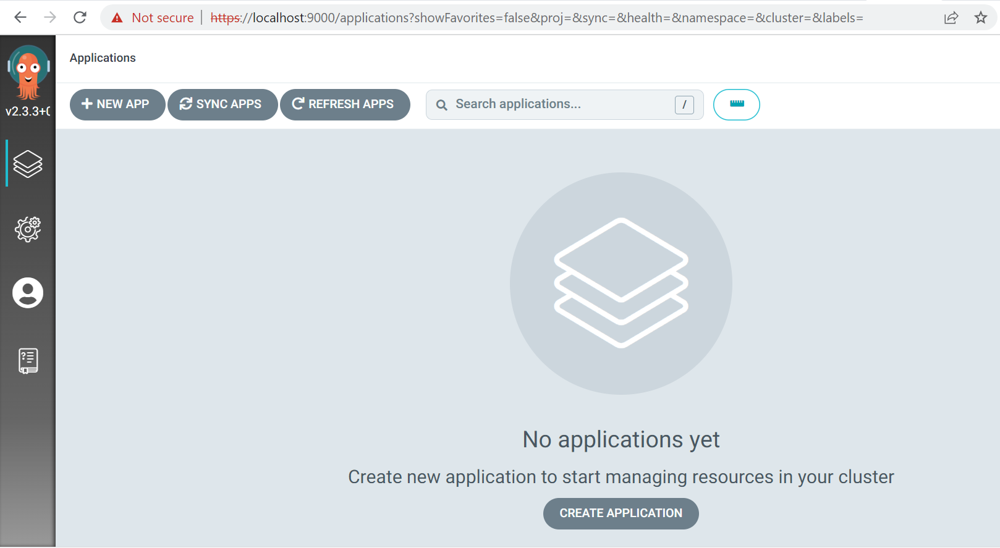

# Install ArgoCD


## Previous Requirements

- Have a Kubernetes Cluster. With Minikube is enough.
- Kubectl. With Minikube you can use ```minikube kubectl```

## Installation

```
kubectl create namespace argocd
kubectl apply -n argocd -f https://raw.githubusercontent.com/argoproj/argo-cd/stable/manifests/core-install.yaml
```

More details in the official ArgoCD install page. https://argo-cd.readthedocs.io/en/stable/getting_started

## Accesing the UI

- Use a port forward to bind the port 443 to a port in your local machine

```kubectl port-forward svc/argocd-server -n argocd 9000:443```

- Now you can access the ArgoCD UI

https://localhost:9000/

- When accessing the ArgoCD UI, a browser SSL warning is encountered. This is happening because the ArgoCD server is not setup with SSL certificates to authenticate the server. Hence, an insecure connection is established with the server. As a result, the warning prompt is encountered and you should just bypass the warning page 

- Login credentials can be retrieved using the following commnad
  ```kubectl -n argocd get secret argocd-initial-admin-secret -o jsonpath="{.data.password}" | base64 -d; echo```
   
  Example result:  
  ```cWmlpuNFDdXCZHyd```

  More information in the credentials guide. https://argo-cd.readthedocs.io/en/stable/getting_started/#4-login-using-the-cli


## Test installation

Check if you can access the UI



	