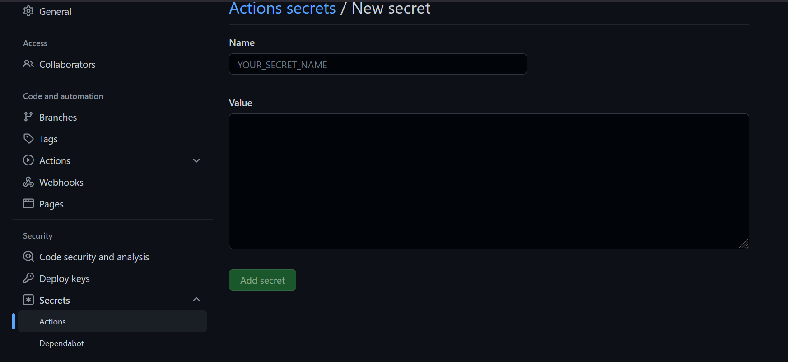

# Github Actions as a CI tool

Github Actions is used to create the Docker Image and push to the Docker Hub registry. 
In a real scenarios this images would be saved in a private registry.

# Steps

- Create a .github folder in the project root
- Create a workflows folder inside .github folder
- Create a yml file would describe the steps to performs the operations. Like, code build, test, etc

You can check the ```./.github/workflows/docker-build.yml```

- In the github repo it is neccesary create two variables with the DockerHub login information
  - DOCKERHUB_USERNAME
  - DOCKERHUB_TOKEN



