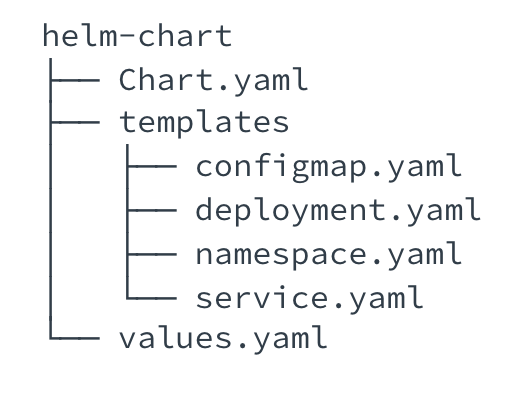

# Configuration Manager

A Configuration Manager gives a mechanism to store and manage manifests in a reliable, scalable, and flexible way.

# Helm  

Helm is a package manager, that manages Kubernetes manifests through charts. A Helm chart is a collection of YAML files that describe the state of multiple Kubernetes resources. These files can be parametrized using Go template.

A Helm chart is composed of the following files:
    • Chart.yaml - expose chart details, such as description, dependencies and version 
    • templates/ folder - contains templates YAML manifests for Kubernetes resources 
    • values.yaml - default input configuration file for the chart. If no other values file is supplied, the parameters in this file will be used. 

    
