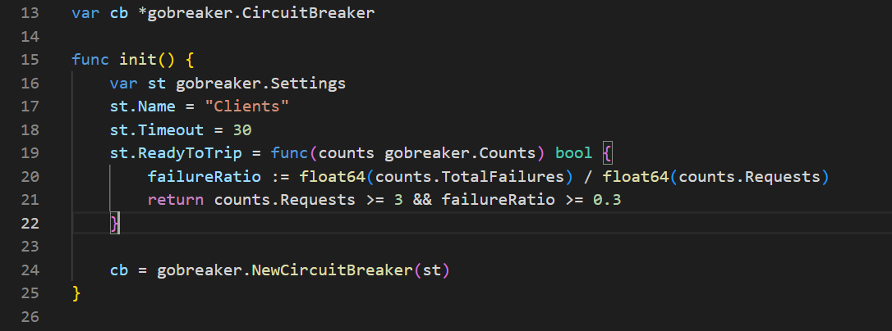

# Circuit breaker Pattern

The Circuit Breaker pattern, can prevent an application from repeatedly trying to execute an operation that's likely to fail. Allowing it to continue without waiting for the fault to be fixed or wasting CPU cycles while it determines that the fault is long lasting.

To invoke the request is using like a proxy that if there are many failures the circuit breaker trips and during a Timeout all request fail inmediatily. In that way we give time to the service to recover, and we do not waste time and resources waiting for a failing service. 

## References
(https://microservices.io/patterns/reliability/circuit-breaker.html)
(https://docs.microsoft.com/en-us/azure/architecture/patterns/circuit-breaker)

## Implementing Circuit Breaker with Go-Kit

Go-Kit has the package ```github.com/go-kit/kit/circuitbreaker``` that provide differents implementations of circuit breaker. The advantage of using the Go-Kit circuit breaker package is that returns an endpoint.Middleware and you can wrap your clients endpoints.

In the service ```multiple-operation-svc-go-kit``` we are using the Sony GoBreaker implementation

    